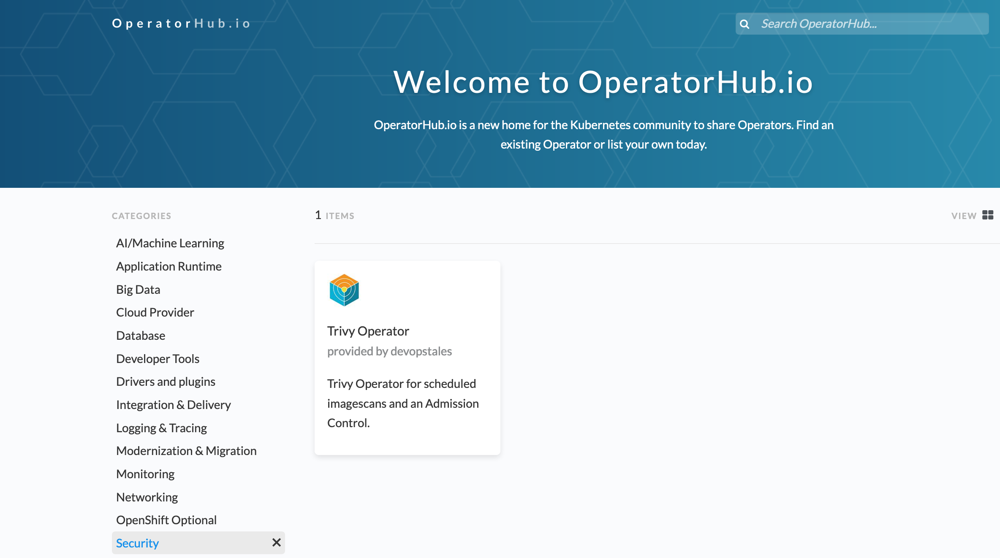
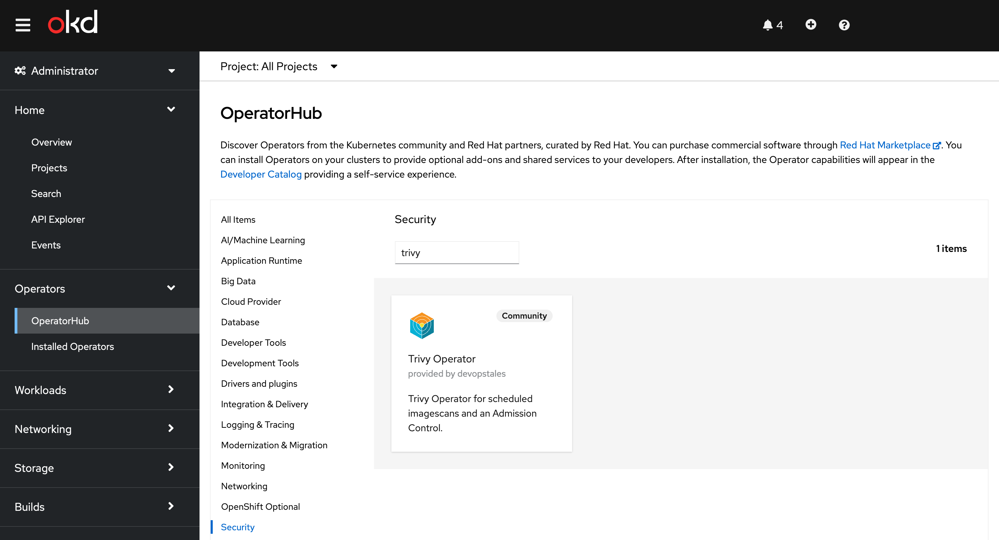

# Installation

## Helm

[Helm], which is a popular package manager for Kubernetes, allows installing applications from parameterized
YAML manifests called Helm [charts].

### Installing from the DevOpsTales Chart Repository

```
helm repo add devopstales https://devopstales.github.io/helm-charts
helm repo update
helm upgrade --install trivy-operator devopstales/trivy-operator
```

> **Tip**: List all releases using `helm list`.

### Advanced Configuration

The command deploys trivy-operator on the Kubernetes cluster in the default configuration. The [Parameters](/trivy-operator/configuration/)
section lists the parameters that can be configured during installation.

### Uninstall

You can uninstall the operator with the following command:

```
helm uninstall trivy-operator
```

You have to manually delete custom resource definitions an the validating webhook configurations created by the `helm install` command:

!!! danger
    Deleting custom resource definitions will also delete all security reports generated by the operator.

    ```
    kubectl delete crd namespace-scanners.trivy-operator.devopstales.io
    kubectl delete crd vulnerabilityreports.trivy-operator.devopstales.io
    ```

    ```
    kubectl delete validatingwebhookconfigurations trivy-image-validator.devopstales.io
    ```

## OperatorFramework

With the release of trivy-operator 2.3 I published trivy-operator with OperatorFramework to OperatorHub:





[Helm]: https://helm.sh/docs/helm/helm/#helm
[charts]: https://helm.sh/docs/topics/charts/