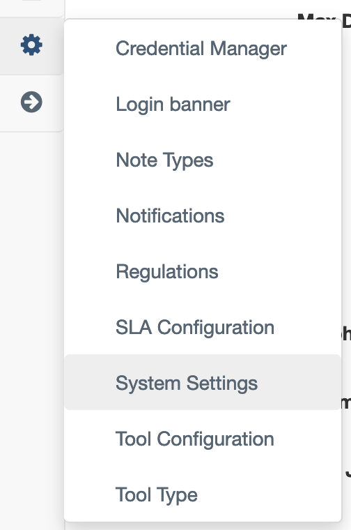
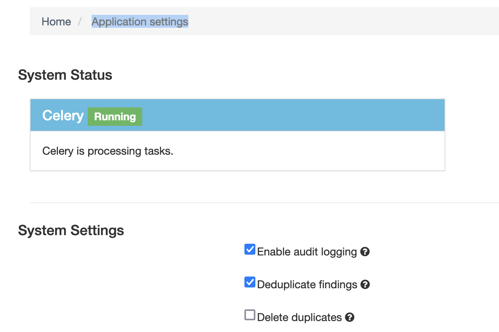

# DefectDojo

DefectDojo is an Open-Source DevSecOps and vulnerability management tool. DefectDojo allows you to manage your application security program, maintain product and application information, triage vulnerabilities and push findings to systems like JIRA and Slack. DefectDojo enriches and refines vulnerability data using a number of heuristic algorithms that improve with the more you use the platform.

## Install with Helm chart

```bash
helm repo add defectdojo 'https://raw.githubusercontent.com/DefectDojo/django-DefectDojo/helm-charts'
helm repo update

helm upgrade --install \
  defectdojo \
  defectdojo/defectdojo \
  --set django.ingress.enabled=true \
  --set django.ingress.activateTLS=false \
  --set createSecret=true \
  --set createRabbitMqSecret=true \
  --set createRedisSecret=true \
  --set createMysqlSecret=true \
  --set createPostgresqlSecret=true \
  --set host=defectdojo.k8s.intra
```

To find out the password, run the following command:


```bash
echo "DefectDojo admin password: $(kubectl \
  get secret defectdojo \
  --output jsonpath='{.data.DD_ADMIN_PASSWORD}' \
  | base64 --decode)"
```

Enable deduplication for findings:

Select Gear icon and `Aplication Settings`:



Then thick `Deduplicate findings`:


### Enable DefectDojo integration for trivy-operator

To enable the DefectDojo integration for trivy-operator you need to enable it in the `NamespaceScanner` object:

```yaml
  integrations:
    policyreport: True
    defectdojo:
      host: "https://defectdojo.rancher-desktop.intra"
      api_key: "xyz456ucdssd67sd67dsg"
```