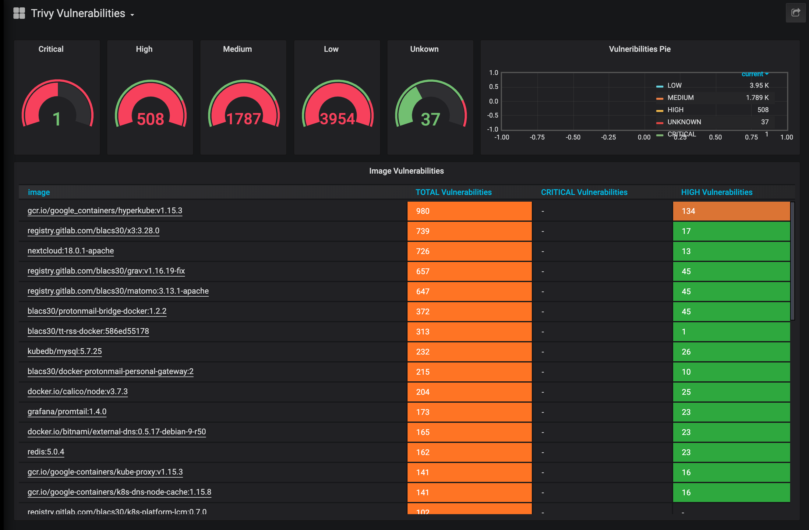

# Monitoring

Trivy-operatos has a prometheus endpoint on port `9115` and can be deployed wit `ServiceMonitor` for automated scrapping. You can enable monitoring in the helm chart:

```yaml
monitoring:
  port: "9115"

serviceMonitor:
  enabled: true
  namespace: "monitoring-system"
```

```bash
curl -s http://10.43.179.39:9115/metrics | grep trivy_vulnerabilities
# HELP trivy_vulnerabilities_sum Container vulnerabilities
# TYPE trivy_vulnerabilities_sum gauge
trivy_vulnerabilities_sum{exported_namespace="trivytest",image="docker.io/openshift/mysql-56-centos7:latest",severity="scanning_error"} 1.0
trivy_vulnerabilities_sum{exported_namespace="trivytest",image="docker.io/nginxinc/nginx-unprivileged:latest",severity="UNKNOWN"} 0.0
trivy_vulnerabilities_sum{exported_namespace="trivytest",image="docker.io/nginxinc/nginx-unprivileged:latest",severity="LOW"} 83.0
trivy_vulnerabilities_sum{exported_namespace="trivytest",image="docker.io/nginxinc/nginx-unprivileged:latest",severity="MEDIUM"} 5.0
trivy_vulnerabilities_sum{exported_namespace="trivytest",image="docker.io/nginxinc/nginx-unprivileged:latest",severity="HIGH"} 7.0
trivy_vulnerabilities_sum{exported_namespace="trivytest",image="docker.io/nginxinc/nginx-unprivileged:latest",severity="CRITICAL"} 4.0
trivy_vulnerabilities_sum{exported_namespace="trivytest",image="docker.io/library/nginx:1.18",severity="UNKNOWN"} 0.0
trivy_vulnerabilities_sum{exported_namespace="trivytest",image="docker.io/library/nginx:1.18",severity="LOW"} 126.0
trivy_vulnerabilities_sum{exported_namespace="trivytest",image="docker.io/library/nginx:1.18",severity="MEDIUM"} 25.0
trivy_vulnerabilities_sum{exported_namespace="trivytest",image="docker.io/library/nginx:1.18",severity="HIGH"} 43.0
trivy_vulnerabilities_sum{exported_namespace="trivytest",image="docker.io/library/nginx:1.18",severity="CRITICAL"} 21.0
# HELP trivy_vulnerabilities Container vulnerabilities
# TYPE trivy_vulnerabilities gauge
trivy_vulnerabilities{exported_namespace="trivytest",image="docker.io/nginxinc/nginx-unprivileged:latest",installedVersion="2.2.4",pkgName="pkgName",severity="LOW",vulnerabilityId="CVE-2011-3374"} 1.0
trivy_vulnerabilities{exported_namespace="trivytest",image="docker.io/nginxinc/nginx-unprivileged:latest",installedVersion="8.32-4",pkgName="pkgName",severity="LOW",vulnerabilityId="CVE-2016-2781"} 1.0
trivy_vulnerabilities{exported_namespace="trivytest",image="docker.io/nginxinc/nginx-unprivileged:latest",installedVersion="8.32-4",pkgName="pkgName",severity="LOW",vulnerabilityId="CVE-2017-18018"} 1.0
trivy_vulnerabilities{exported_namespace="trivytest",image="docker.io/nginxinc/nginx-unprivileged:latest",installedVersion="7.74.0-1.3",pkgName="pkgName",severity="CRITICAL",vulnerabilityId="CVE-2021-22945"} 1.0
trivy_vulnerabilities{exported_namespace="trivytest",image="docker.io/nginxinc/nginx-unprivileged:latest",installedVersion="7.74.0-1.3",pkgName="pkgName",severity="HIGH",vulnerabilityId="CVE-2021-22946"} 1.0
trivy_vulnerabilities{exported_namespace="trivytest",image="docker.io/nginxinc/nginx-unprivileged:latest",installedVersion="7.74.0-1.3",pkgName="pkgName",severity="MEDIUM",vulnerabilityId="CVE-2021-22947"} 1.0
trivy_vulnerabilities{exported_namespace="trivytest",image="docker.io/nginxinc/nginx-unprivileged:latest",installedVersion="7.74.0-1.3",pkgName="pkgName",severity="LOW",vulnerabilityId="CVE-2021-22898"} 1.0
```

```bash
curl -s http://10.43.179.39:9115/metrics | grep ac_vulnerabilities

# HELP ac_vulnerabilities Admission Controller vulnerabilities
# TYPE ac_vulnerabilities gauge
ac_vulnerabilities{exported_namespace="trivytest",image="nginxinc/nginx-unprivileged:latest",severity="UNKNOWN"} 0.0
ac_vulnerabilities{exported_namespace="trivytest",image="nginxinc/nginx-unprivileged:latest",severity="LOW"} 83.0
ac_vulnerabilities{exported_namespace="trivytest",image="nginxinc/nginx-unprivileged:latest",severity="MEDIUM"} 6.0
ac_vulnerabilities{exported_namespace="trivytest",image="nginxinc/nginx-unprivileged:latest",severity="HIGH"} 6.0
ac_vulnerabilities{exported_namespace="trivytest",image="nginxinc/nginx-unprivileged:latest",severity="CRITICAL"} 4.0
```


