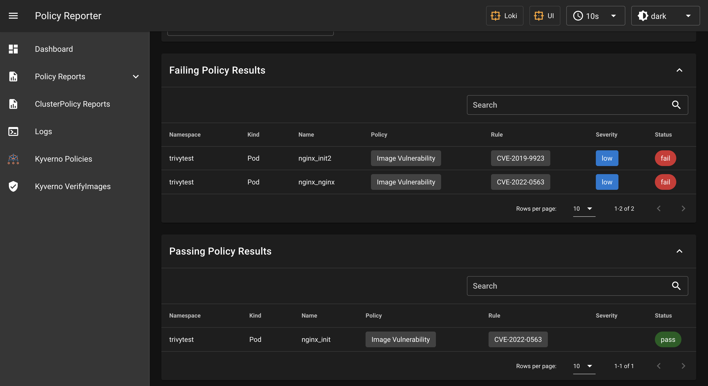

# Policy Reporter UI

The [Policy Reporter UI](https://github.com/kyverno/policy-reporter) is a monitoring and Observability Tool for the PolicyReport CRD with an optional UI. It is created by Kyverno. The main goal was a tool to visualize the resolutes of the Kyverno policies, but because it uses the [PolicyReports](../..//crds/policy-report/) CRD it can visualize the resolutes of the trivy-operator scans.

### Installation with Helm v3

```bash
helm repo add policy-reporter https://kyverno.github.io/policy-reporter
helm repo update

helm install policy-reporter policy-reporter/policy-reporter \
--set kyvernoPlugin.enabled=true --set ui.enabled=true --set ui.plugins.kyverno=true \
-n policy-reporter --create-namespace

kubectl port-forward service/policy-reporter-ui 8082:8080 -n policy-reporter
```

Open `http://localhost:8082/` in your browser.

### VulnerabilityReports


### ClusterVulnerabilityReports
