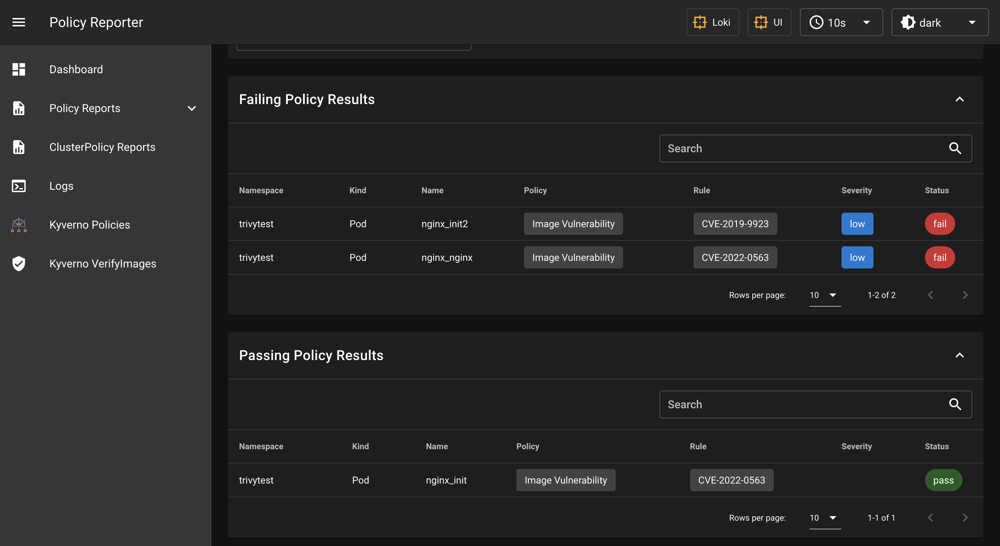

# Quick Start

## Before you Begin

You need to have a Kubernetes cluster, and the kubectl command-line tool must be configured to communicate with your
cluster. If you do not already have a cluster, you can create one by installing [minikube], [kind] or [microk8s], or you can use the following [Kubernetes playground].

You also need the Trivy-Operator to be installed with [Helm](./installation.md).

## Workloads Scanning

Let's create a Deployment that we know is vulnerable:

```
kubectl apply -f https://raw.githubusercontent.com/devopstales/trivy-operator/main/deploy/kubernetes/10_demo.yaml
```

## Scheduled Image scans

Default trivy-operator execute a scan script every 5 minutes. It will get images from all the namespaces with the label `trivy-scan=true`, and then check these images with trivy for vulnerabilities. You can label an existing namespace with the fallowing command:

```
kubectl label namespaces guestbook-demo trivy-scan=true
```

## Reports
If enabled the operator creates a VulnerabilityReport, and a PolicyReport for each different container.

```
kubectl get vulnerabilityreports -n trivytest
```

<details>
<summary>Result</summary>
```
NAME                        REPOSITORY       TAG      AGE   STATUS
pod-nginx-container-init    library/alpine   latest   18m   OK
pod-nginx-container-init2   library/ubuntu   latest   18m   OK
pod-nginx-container-nginx   library/nginx    latest   18m   OK
```
</details>

```
kubectl get policyreports -n trivytest
```

<details>
<summary>Result</summary>
```
NAME                                   PASS   FAIL   WARN   ERROR   SKIP   AGE
trivy-vuln-pod-nginx-container-init    1      0      0      0       0      17m
trivy-vuln-pod-nginx-container-init2   0      0      21     0       0      17m
trivy-vuln-pod-nginx-container-nginx   0      32     106    0       0      17m
```
</details>

!!! tip
    You can get and describe `vulnerabilityreports` and `policyreports` as built-in Kubernetes objects:
    ```
    kubectl get vulnerabilityreport pod-nginx-container-init -o json
    kubectl describe policyreport trivy-vuln-pod-nginx-container-init
    ```

Notice that scan reports generated by the operator are controlled by Kubernetes workloads.

```
kubectl tree pod nginx -n trivytest
```

<details>
<summary>Result</summary>
```
NAMESPACE  NAME                                                 READY  REASON  AGE
trivytest  Pod/nginx                                            True           4h40m
trivytest  ├─CiliumEndpoint/nginx                               -              4h40m
trivytest  ├─PolicyReport/trivy-vuln-pod-nginx-container-init   -              20m
trivytest  ├─PolicyReport/trivy-vuln-pod-nginx-container-init2  -              20m
trivytest  ├─PolicyReport/trivy-vuln-pod-nginx-container-nginx  -              20m
trivytest  ├─VulnerabilityReport/pod-nginx-container-init       -              20m
trivytest  ├─VulnerabilityReport/pod-nginx-container-init2      -              20m
trivytest  └─VulnerabilityReport/pod-nginx-container-nginx      -              20m
```
</details>

!!! note
    The [tree] command is a kubectl plugin to browse Kubernetes object hierarchies as a tree.

## Policy Reporter UI Screenshots

VulnerabilityReports



[minikube]: https://minikube.sigs.k8s.io/docs/
[kind]: https://kind.sigs.k8s.io/docs/
[microk8s]: https://microk8s.io/
[Kubernetes playground]: http://labs.play-with-k8s.com/
[tree]: https://github.com/ahmetb/kubectl-tree
